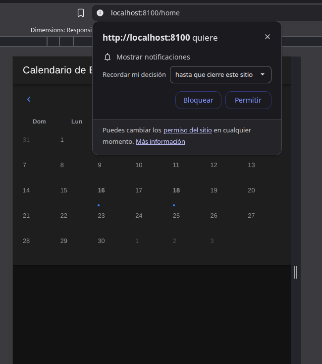

# Eventos App

Este proyecto es una aplicación móvil desarrollada con Angular, Ionic y Capacitor para la gestión de eventos.

## Notificaciones 

   En el archivo notification.servide.ts tenemos el codigo relacionado a las notificacion es push, en este caso las hemos habilitado en local

   Acá solicitamos los permisos para enviar notificaciones

   ```ts
     async requestPermissions() {
      const { display } = await LocalNotifications.requestPermissions();
         if (display === 'denied') {
            console.warn('Notificaciones no permitidas');
         }
      }
   ```


   Registro de recordatorios para su notificación

   ```ts

   async scheduleEventReminders(event: Event) {
    if (!event.reminders) return;

    const notifications = event.reminders.map((minutes, index) => {
      const remindAt = new Date(new Date(event.startAt).getTime() - minutes * 60000);

      return {
        id: Number(`${event.id.replace(/\D/g, '').slice(0, 6)}${index}`), // id numérico
        title: `Recordatorio: ${event.title}`,
        body: event.description || 'No olvides este evento',
        schedule: { at: remindAt },
        sound: undefined,
        extra: { eventId: event.id },
      };
    });

    await LocalNotifications.schedule({ notifications });
  }


   ```


## Funcionalidades

A continuación se muestran las imágenes disponibles en la raíz del proyecto, cada una acompañada de un espacio para su explicación:

### dellate de evento.png

*Descripción:* Vista detallada de un evento individual.

### doble evento dia.png

*Descripción:* Ejemplo de dos eventos programados para el mismo día.

### doble evento.png

*Descripción:* Visualización de eventos dobles en la agenda.

### eventos del dia.png

*Descripción:* Listado de todos los eventos del día seleccionado.

### notificaciones.png

*Descripción:* Pantalla de notificaciones de la aplicación.

## Estructura del proyecto

- `eventos/` - Código fuente de la aplicación
- Imágenes en la raíz del proyecto

## Instalación y uso

1. Instala las dependencias:
   ```bash
   npm install
   ```
2. Ejecuta la aplicación:
   ```bash
   ionic serve
   ```

---

> Proyecto para examen transversal 2025
